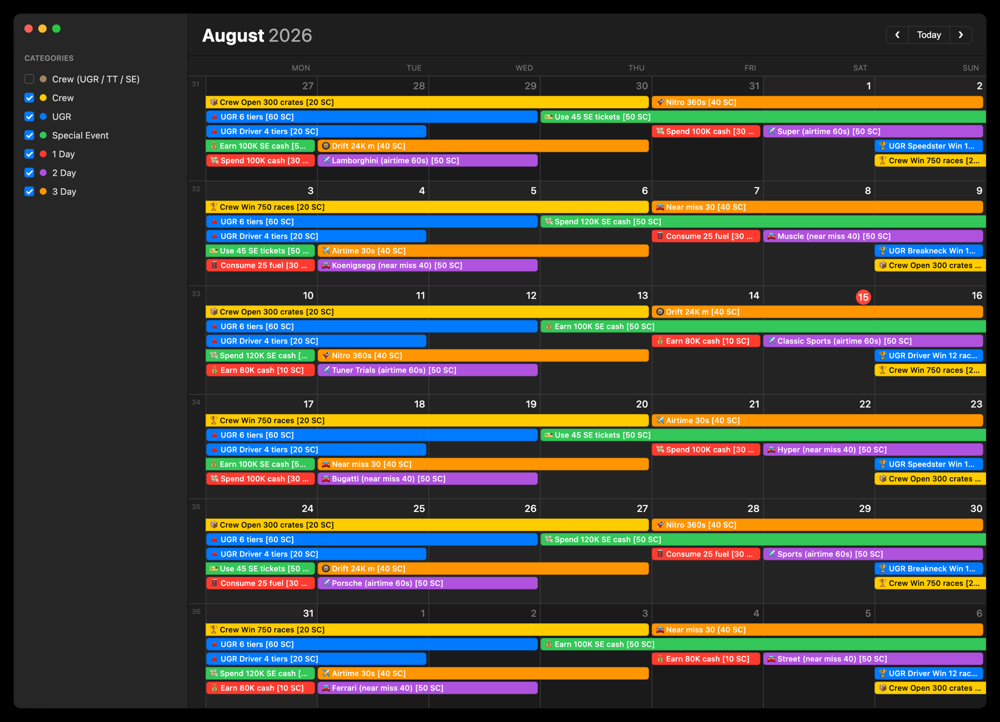

# NFS No Limits — Mission Calendar

**➜ [Open the calendar](https://leowu20250101.github.io/nfsnl-mission-calendar/)**

Know what today's missions are, and what next month's will be.

NFSNL's daily and weekly missions aren't random — they rotate on fixed 2-, 3-, 4- and
6-week cycles. This calendar computes them, so you can scroll to any month, past or
future, and plan around the missions before they arrive.

> Unofficial fan project. Not affiliated with or endorsed by EA or Firemonkeys.

## What you get

- **Any month, any year.** Hit Next as far ahead as you like — nothing is hardcoded.
- **Missions shown as bars.** A 5-day crew event is drawn across all five days, so you
  can see at a glance what overlaps with what and how much time is left.
- **Today is highlighted** using the game's real reset moment (02:30 UTC+8), not your
  device's midnight — so the "current" mission is right wherever you are.
- **Filters in the sidebar.** Untick the mission types you don't chase. Crew missions
  locked to a mode (UGR / Tuner Trials / Special Event) start hidden.
- **Week numbers** down the left edge, matching Apple Calendar and any other ISO
  calendar.

## Reading the calendar

Every mission is colored by type, and the sidebar checkbox for that color turns it on
or off:

| Color | Type | Examples |
| --- | --- | --- |
| 🔴 Red | 1 Day | Earn 80K cash, Consume 25 fuel |
| 🟣 Purple | 2 Day | Car brand and car type missions |
| 🟠 Orange | 3 Day | Nitro, drift, airtime, near miss |
| 🔵 Blue | UGR | Tier missions, weekend division races |
| 🟢 Green | Special Event | SE cash, SE tickets |
| 🟡 Yellow | Crew | Crew wins, crates |
| 🟤 Brown | Crew (UGR / TT / SE) | Crew missions tied to one mode — hidden by default |

The `[40 SC]` on each bar is that mission's reward.

## The rotation

You don't need any of this to use the calendar — it's here if you want to work a week
out by hand, or check the app against what you see in game.

Count weeks from the week of **Monday 10 Aug 2026** (ISO week 33), which is week 0.
Take that week number, divide by the cycle length, and look up the remainder.

**Every week, no rotation**

| Day | Mission |
| --- | --- |
| Mon | UGR Driver 4 tiers (2 days) · UGR 6 tiers (3 days) |
| Thu | Crew Win 600 SE races (5 days) |
| Sat | Crew Consume 240 fuel in Tuner Trials (7 days) |

**Divide by 3** — the 1-day mission on Mon & Fri, and Sunday's UGR division

| Remainder | Mon / Fri (1 day) | Sun UGR division | Thu SE mission (5 days) |
| --- | --- | --- | --- |
| 0 | Earn 80K cash | Driver | Earn 100K SE cash |
| 1 | Spend 100K cash | Speedster | Use 45 SE tickets |
| 2 | Consume 25 fuel | Breakneck | Spend 120K SE cash |

**Divide by 4** — the 3-day task (Friday runs two steps ahead of Tuesday)

| Remainder | Tue | Fri |
| --- | --- | --- |
| 0 | Nitro 360s | Drift 24K m |
| 1 | Near miss 30 | Airtime 30s |
| 2 | Drift 24K m | Nitro 360s |
| 3 | Airtime 30s | Near miss 30 |

**Divide by 6** — the 2-day car missions

| Remainder | Tue — brand | Sat — type |
| --- | --- | --- |
| 0 | Tuner Trials (airtime 60s) | Classic Sports (airtime 60s) |
| 1 | Bugatti (near miss 40) | Hyper (near miss 40) |
| 2 | Porsche (airtime 60s) | Sports (airtime 60s) |
| 3 | Ferrari (near miss 40) | Street (near miss 40) |
| 4 | Lamborghini (airtime 60s) | Super (airtime 60s) |
| 5 | Koenigsegg (near miss 40) | Muscle (near miss 40) |

Watch out for the pair that looks alike: the 2-day car missions want **near miss 40 /
airtime 60s**, the 3-day tasks want **near miss 30 / airtime 30s**.

**Divide by 2** — the 5-day crew events

| Remainder | Wed | Sun |
| --- | --- | --- |
| 0 | Crew UGR Nitro 60K s | Crew Win 750 races |
| 1 | Crew UGR Drift 600K m | Crew Open 300 crates |

## Running it yourself

The whole thing is one `index.html` — no build, no dependencies, no tracking. Download
it and open it in any browser, on a laptop or a phone, online or off.

## If the rotation ever shifts

The tables come from months of community mission logs and match the game as of August
2026. If EA changes the rotation, open an issue — or fix it yourself: the mission data
and the anchor date are plain JavaScript near the bottom of `index.html`.

## License

[MIT](LICENSE). Mission names and other game content are the property of Electronic
Arts.
